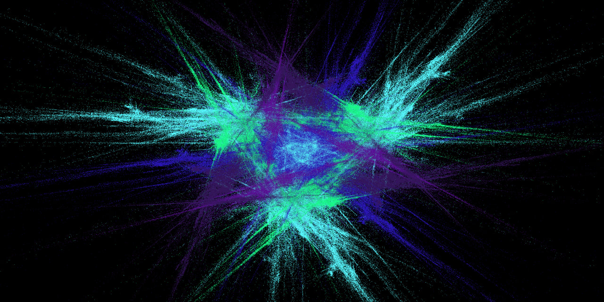
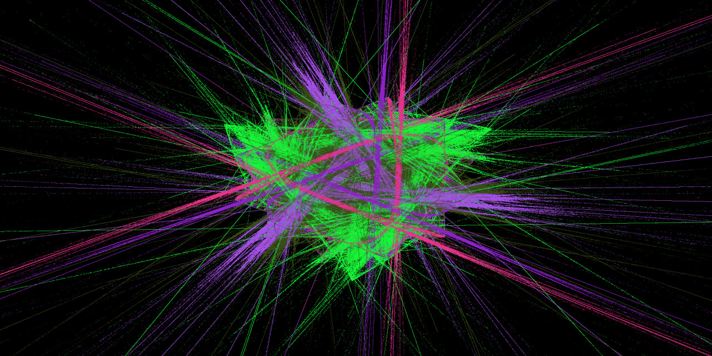
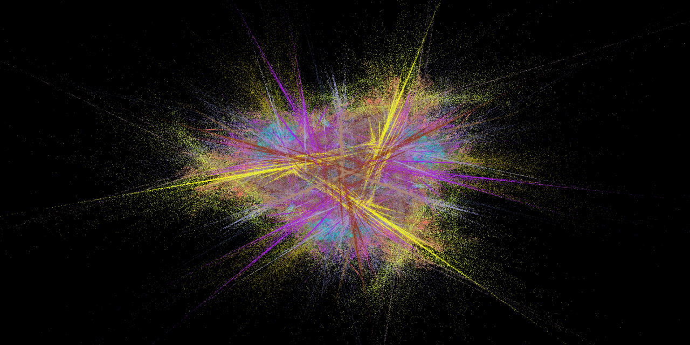
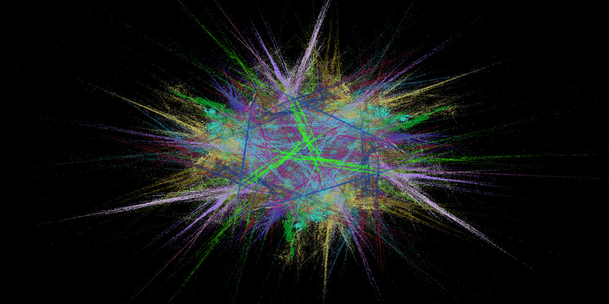
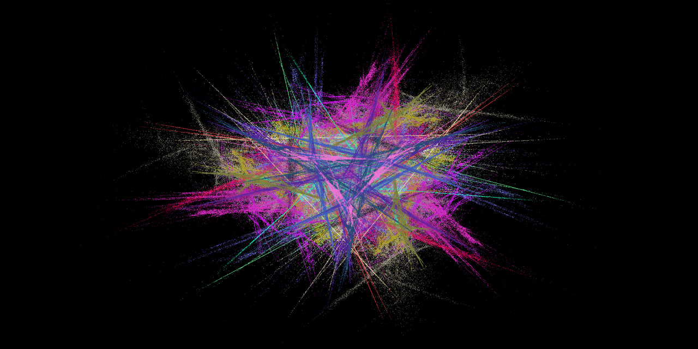
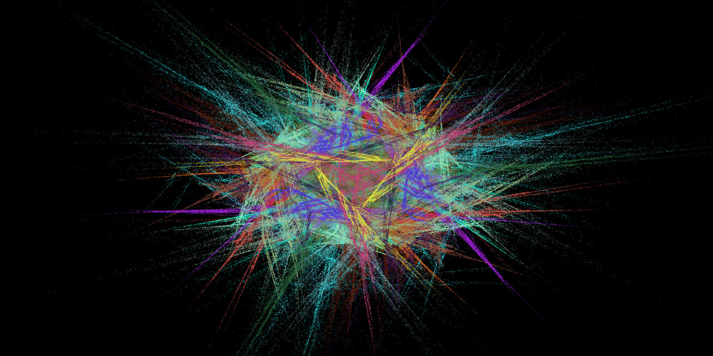
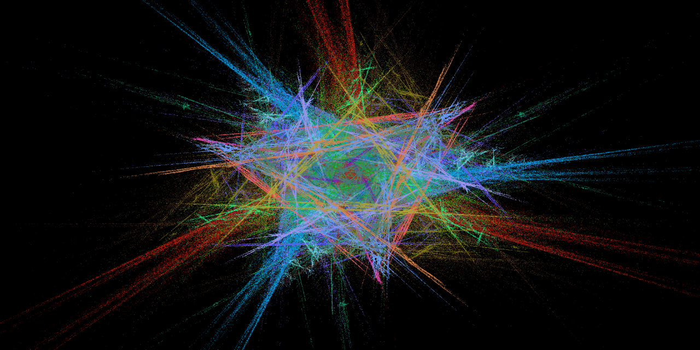
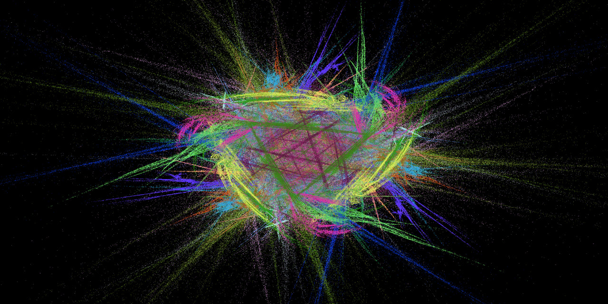
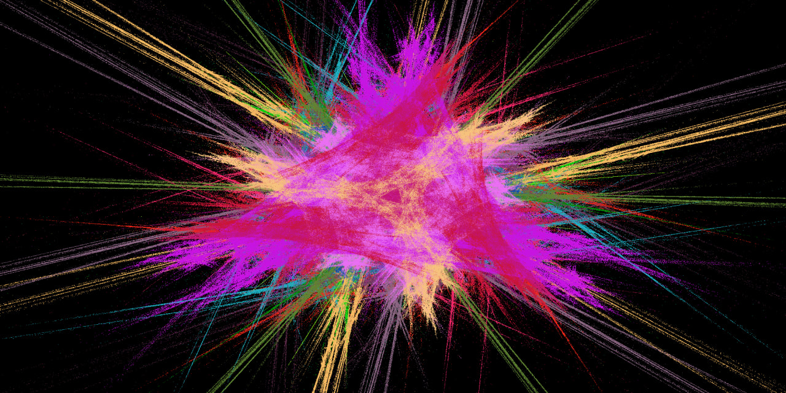

# Академия бэкенда от Т-Банка 2024, 1 семестр, Проект 4: Фрактальное пламя

## Описание

В проекте нужно реализовать алгоритм генерации изображения фрактального пламени, основанного на идее Chaos Game. Требуется реализовать однопоточную и многопоточную версию программы.

## Функциональные требования
- Реализация цветного алгоритма генерации фрактального пламени.
- Возможность запуска как в однопоточном, так и в многопоточном режиме.
- Настройка параметров генерации: размер изображения, количество итераций, набор трансформационных функций и т.д.
- Реализовать 5 трансформаций: Fish Eye, Horseshoe, Linear, Sinusoidal, Spherical.
- Реализовать поддержку логарифмической гамма-коррекции.
- Добавить поддержку параметра симметрии.

## Нефункциональные требования
- Программа должна легко конфигурироваться.
- Многопоточная реализация должна работать быстрее однопоточной.
- Опубликованы сравнительные результаты времени работы
- Конфигурация системы
- Время работы
- Количество используемых потоков

## Описание входных и выходных данных
### Ввод
- Размеры изображения (ширина и высота).
- Количество итераций для генерации фрактала.
- Список трансформационных функций и их параметры.
### Вывод
- Изображение фрактального пламени.

## Примеры работы программы










## Начало работы

Для того чтобы собрать проект, и проверить, что все работает корректно, можно
запустить из модального окна IDEA
[Run Anything](https://www.jetbrains.com/help/idea/running-anything.html)
команду:

```shell
mvn clean verify
```

Альтернативно можно в терминале из корня проекта выполнить следующие команды.

Для Unix (Linux, macOS, Cygwin, WSL):

```shell
./mvnw clean verify
```

Для Windows:

```shell
mvnw.cmd clean verify
```

Для окончания сборки потребуется подождать какое-то время, пока maven скачает
все необходимые зависимости, скомпилирует проект и прогонит базовый набор
тестов.

Если вы в процессе сборки получили ошибку:

```shell
Rule 0: org.apache.maven.enforcer.rules.version.RequireJavaVersion failed with message:
JDK version must be at least 22
```

Значит, версия вашего JDK ниже 22.

Если же получили ошибку:

```shell
Rule 1: org.apache.maven.enforcer.rules.version.RequireMavenVersion failed with message:
Maven version should, at least, be 3.8.8
```

Значит, у вас используется версия maven ниже 3.8.8. Такого не должно произойти,
если вы запускаете сборку из IDEA или через `mvnw`-скрипты.

Далее будут перечислены другие полезные команды maven.

Запуск только компиляции основных классов:

```shell
mvn compile
```

Запуск тестов:

```shell
mvn test
```

Запуск линтеров:

```shell
mvn checkstyle:check modernizer:modernizer spotbugs:check pmd:check pmd:cpd-check
```
